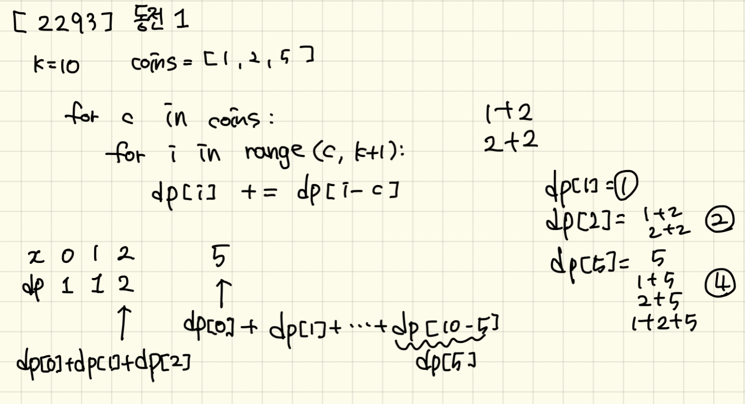

# [[2293]동전1]()

## Dynamic Programming을 이용한 풀이

- 동전들을 하나씩 꺼내면서 검사해준다.
- DP의 크기는 K만큼 설정해주고, `DP[x] = DP[k-coin] + ... DP[coin-coin](=DP[0])` 를 이용하여 풀어준다.
- DP를 결정하는 것이 쉽지 않았던 문제이다.
- 동전의 종류가 제각각이고 원하는 것은 값이 k가 되는 경우이기 때문에 그 안에서 동전 종류를 구하기 위한 DP를 생각해주어야한다!

- 참고 : https://dundung.tistory.com/125s