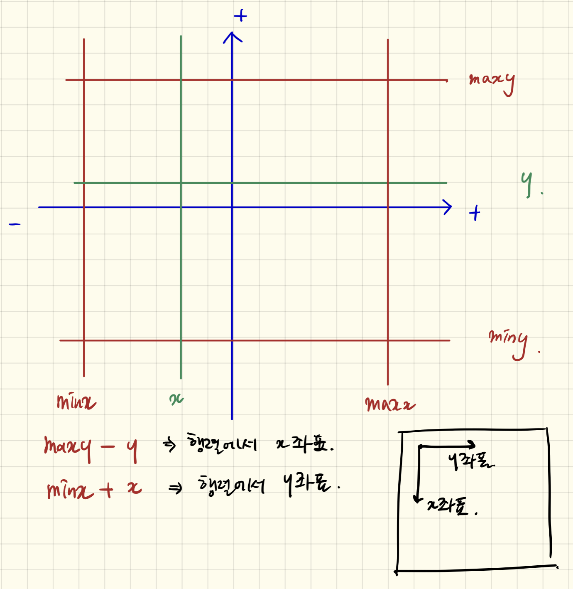

# 교점에 별 만들기

## 첫번째 풀이

```python
import math
from itertools import combinations

def solution(line):
    answer = []

    lines = {}
    for i, l in enumerate(line):
        m = - l[1] // l[0] if l[0] != 0 else 0
        lines[i] = [m] + l

    points = []
    min_x, min_y, max_x, max_y = 1001, 1001, 0, 0
    for m in combinations(lines, 2):
        l1, l2 = lines[m[0]], lines[m[1]]
        m1, a, b, e = l1[0], l1[1], l1[2], l1[3]
        m2, c, d, f = l2[0], l2[1], l2[2], l2[3]

        if (b == 0 and d == 0) or (a == 0 and c == 0):
            continue

        check = False
        if m1 == m2 and a * b == 0:  # 같은 기울기라면
            if a == 0:
                y = - (e // b)
            elif b == 0:
                y = - (e // a)
            if c == 0:
                x = - (f // d)
            elif d == 0:
                x = - (f // c)
            points.append([x, y])
            check = True
        else:
            x = ((b * f) - (e * d)) / ((a * d) - (b * c))
            y = ((e * c) - (a * f)) / ((a * d) - (b * c))

            if x.is_integer() and y.is_integer():
                x, y = int(x), int(y)
                points.append([x, y])
            check = True

        if check:
            max_x = x if max_x < x else max_x
            min_x = x if min_x > x else min_x
            max_y = y if max_y < y else max_y
            min_y = y if min_y > y else min_y

    min_x = 0 if min_x == 1001 else min_x
    min_y = 0 if min_y == 1001 else min_y

    n = max_x - min_x + 1  # 원점을 더한다
    m = max_y - min_y + 1  # 원점을 더한다

    # 원점(origin), index이므로 -1 한다.
    x = (n + 1) // 2 - 1 if n != 1 else x
    y = (m + 1) // 2 - 1 if m != 1 else y

    answer = [["."] * n for _ in range(m)]

    for p in points:
        answer[y - p[1]][x - p[0]] = "*"

    for i, ans in enumerate(answer):
        answer[i] = "".join(ans)

    return answer


if __name__ == '__main__':
    res = solution([[2, -1, 4], [-2, -1, 4], [0, -1, 1], [5, -8, -12], [5, 8, 12]])
    print(res)
```

- 런타임 에러 발생

  

## 두번째 풀이

- 가장 큰 값, 작은 값 만들기

```python
INF = float('inf')
minx, maxx, miny, maxy = INF, -INF, INF, -INF
```

- 좌표가 살짝 헷갈릴 수 있다. 그림으로 살펴보자.

```python
for x, y in points:
    answer[maxy - y][x - minx] = '*'
```
    

