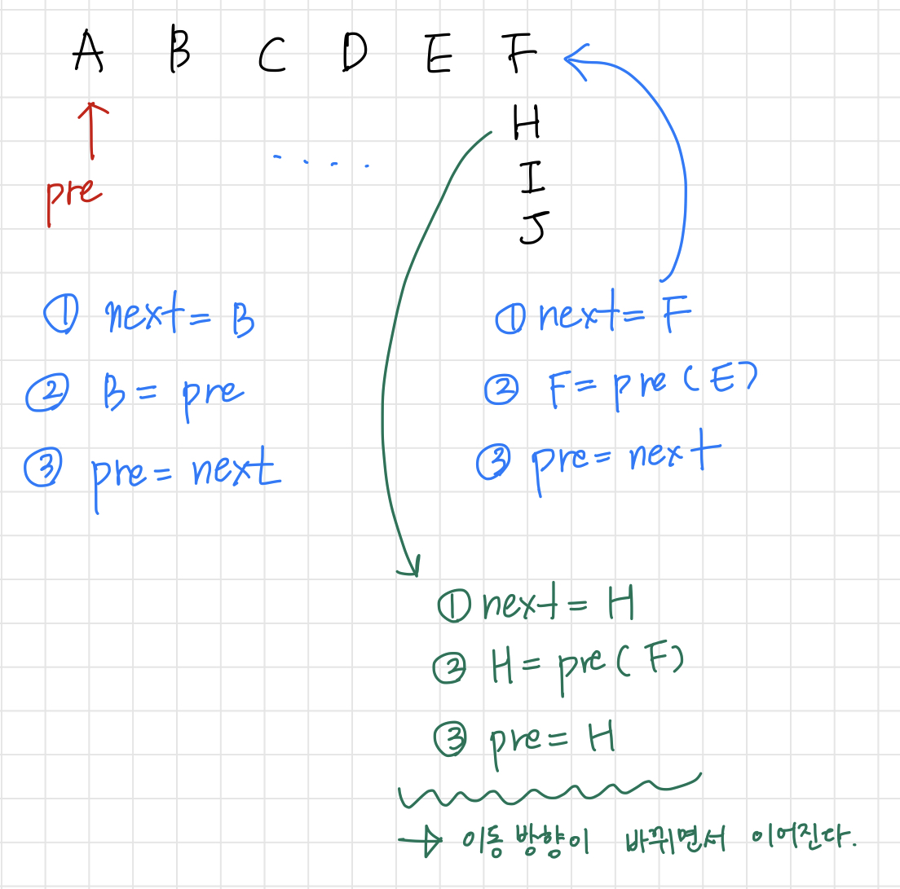

# [행렬테두리회전하기](https://programmers.co.kr/learn/courses/30/lessons/77485)

- pre : 앞선 숫자를 저장
- 하나씩 방문하면서 현재 자리에 있는 숫자를 next에 임시 저장
- pre를 현재 자리에 삽입
- next를 pre에 넣고 자리 이동

- 현재 자리가 가장자리(edge)인 경우 위의 과정이 이후 방향을 전환해준다.